# Building A Chat GPT Clone With Strapi Open AI and LangChain with Next JS 13 Frontend

This article will explore how to build custom routes, services, and controllers to build a backend for our chat app using Strapi, Open AI, and LangChain. We will mostly spend time on the backend Strapi code implementation. But I will include the frontend code repo for you to use with this tutorial.

In this article, you will learn:

- What is LangChain, and why would you use it with Open AI.
- Giving memory to our chat via LangChain
- How to build custom routes, controllers, and services in Strapi.
- Creating a simple session service to manage our chat sessions.
- And log all of our conversation histories and save them to Strapi.

**note:** you must have an Open AI account so we can programmatically make API calls.

We will cover how to set one up later in this tutorial.

So let's get started.

## What Are We Going To Build

The superpower of Strapi is that it is highly customizable and gives you the opportunity to add any additional functionality in code.

Today we will take a look at how to integrate Open AI with LangChain to build our own Chat GPT chat clone with the power to remember.

This article will explore how to build custom routes, services, and controllers to build a backend for our chat app using Strapi, Open AI, and LangChain.

We will mostly spend time on the backend Strapi code implementation. But I will include the frontend code repo for you to use with this tutorial.

In this article, you will learn:

- What is LangChain, and why would you use it with Open AI.
- Giving memory to our chat via LangChain
- How to build custom routes, controllers, and services in Strapi.
- Creating a simple session service to manage our chat sessions.
- And log all of our conversation histories and save them to Strapi.

So let's get started.

## What Are We Going To Build

Before getting too deep into the tutorial, let's check out what we will build. It will be a simple Chat GPT clone with a couple of tricks.

Not only will you be able to have multiple conversations, but we will also give our chat memory with LangCain so that during the conversation, open ai can remember what you are discussing during your session.

We will also have a log of all previous conversation history.

You can see the app in action.


## What Is Open AI

Open AI is behind the popular Chat GPT App; what is awesome is that, as a developer, you have access to a couple of their powerful LLM models to programmatically use in your application.

Which can allow you to build cool things. Checkout out their [Docs](https://platform.openai.com/docs/introduction)

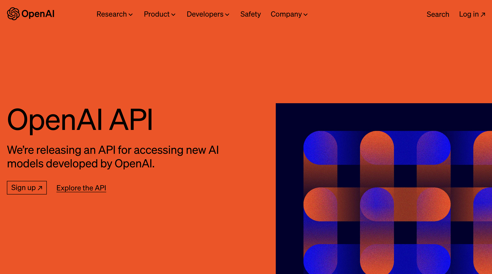

## What Is LangChain

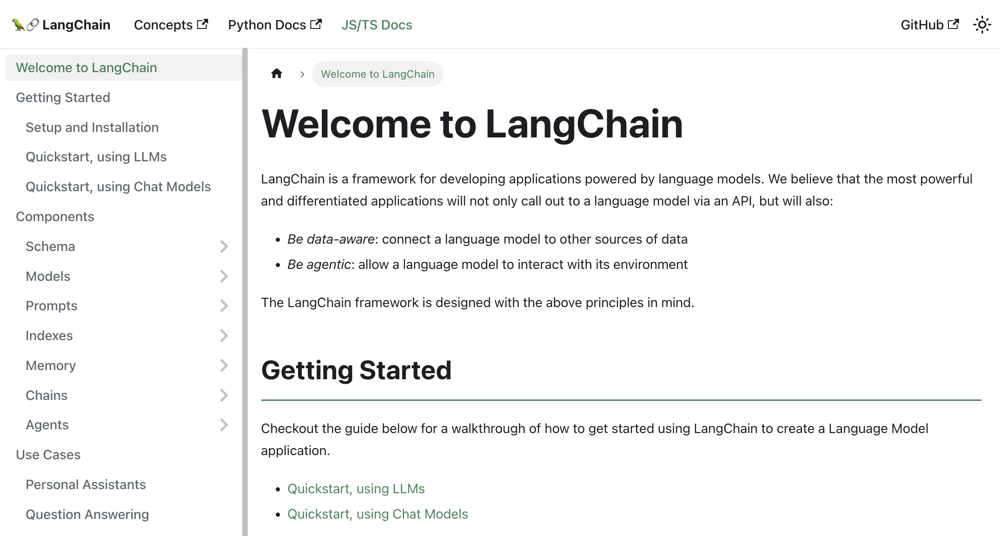

LangChain is a framework designed for leveraging Large Language Models (LLMs).

It allows you to build various applications such as chatbots, Generative Question-Answering (GQA), summarization, and much more.

The core concept revolves around the ability to "chain" together different components, allowing us to create advanced use cases with LLMs.

Here are some examples.

- Prompt Templates
- LLMs: We can integrate large language models, not just Chat GPT
- Agents: Agents will continue to self-prompt until the task is completed.
- Memory: LangChain provides mechanisms to implement short-term and long-term memory within the chat application.

By leveraging the power of LangChain, we can create a chat application that not only engages in multiple conversations but also possesses the ability to remember previous interactions.

Let's dive into the implementation details and get started with building our Chat GPT clone empowered with LangChain's memory capabilities.

**note:** this is a popular Python framework, but they have a Javascript version too.

You can checkout there docs (here)[https://js.langchain.com/docs/].

## Project Overview

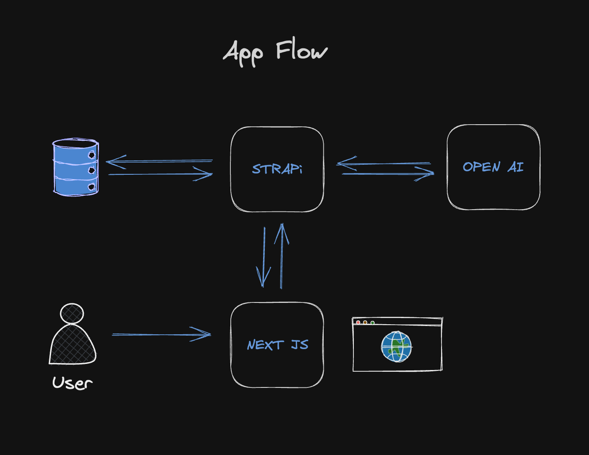

Our user will interact with our Strapi backend with our Next Js Frontend, or you can use Postman or Insomnia to test the API.

All of the logic will be within Strapi, including making a request to Open AI. Since everything runs on the server, we never have to worry about leaking our Open AI Token.

We will also make an authorized request to our Strapi backend to prevent anyone without the Token from being able to use our API from anywhere but our Next JS website.

**Note:** For the tutorial's brevity, I did not implement user authentication but something that we can easily do in the future.

And instead just created an API Token that we can pass when making requests to our backend.

## Building Our Backend

**Setting Up Strapi**

Let's start by creating our Strapi app by running the following command.

```bash
  npx create-strapi-app@latest strapi-chat --quickstart
```

The `quickstart` command will set up Strapi for us, automatically running SQLite as a database. This can be changed in production.

You can check out [Strapi Quick Start](https://docs.strapi.io/dev-docs/quick-start) guide for more details.

Once the process is complete, you should be greeted with the **Welcome Strapi Screen**. Go ahead and create your first **admin** user.

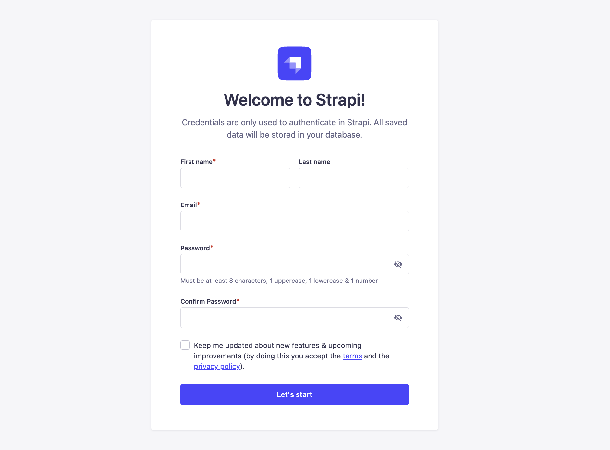

**Generating Our API**

Let's use `strapi generate` command to start building out our project. You can learn more about it [here](https://docs.strapi.io/dev-docs/cli#strapi-generate).

Run the following command to get started.

```bash
  yarn strapi generate
```

Chose `Api` option.

```bash
$ strapi generate
? Strapi Generators (Use arrow keys)
❯ api - Generate a basic API
```

I will call mine `strapi-chat`

```bash
? Strapi Generators api - Generate a basic API
? API name strapi-chat
? Is this API for a plugin? No
✔  ++ /api/strapi-chat/routes/strapi-chat.js
✔  ++ /api/strapi-chat/controllers/strapi-chat.js
✔  ++ /api/strapi-chat/services/strapi-chat.js
✨  Done in 66.65s.
➜  strapi-chat git:(main) ✗
```

This will create a basic scaffolding for our API.

We should have our `strapi-chat` route, controller, and service.

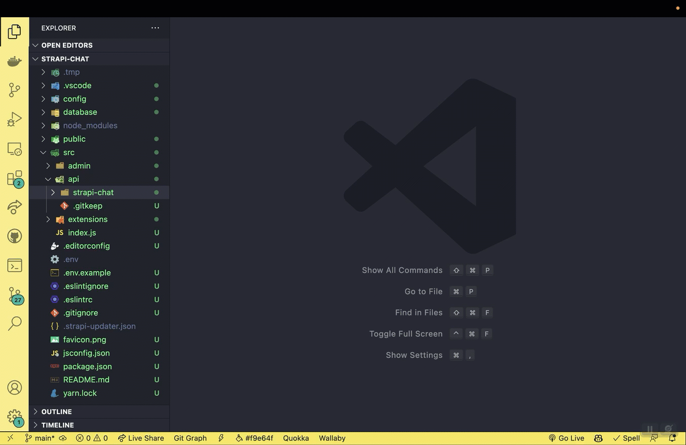

Let's uncomment out the example code and make our first request.

Route File: `strapi-chat/routes/strapi-chat.js`

```javascript
module.exports = {
  routes: [
    {
      method: "GET",
      path: "/strapi-chat",
      handler: "strapi-chat.exampleAction",
      config: {
        policies: [],
        middlewares: [],
      },
    },
  ],
};
```

Controller File: `strapi-chat/controllers/strapi-chat.js`

```javascript
"use strict";

/**
 * A set of functions called "actions" for `strapi-chat`
 */

module.exports = {
  exampleAction: async (ctx, next) => {
    try {
      ctx.body = "ok";
    } catch (err) {
      ctx.body = err;
    }
  },
};
```

We will not worry about the services folder for now, but we will create a few custom services later.

First, let's restart our Strapi application by running the following command.

```bash
	yarn develop
```

Since we just created a new route and a controller, we should be able to see it in our Strapi Admin area.

Navigate to **settings->roles->public->permissions**

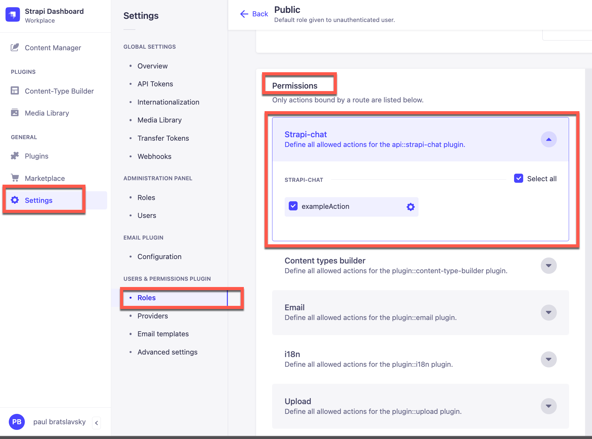

Make sure you check the permissions check box to activate the route and save.

We can test this route by making a **GET** request to `http://localhost:1337/api/strapi-chat`

We can now test our custom endpoint with a Postman or Insomnia; in my case, I will be using Insomnia.

We should see the "OK" response that is returned by our controller.

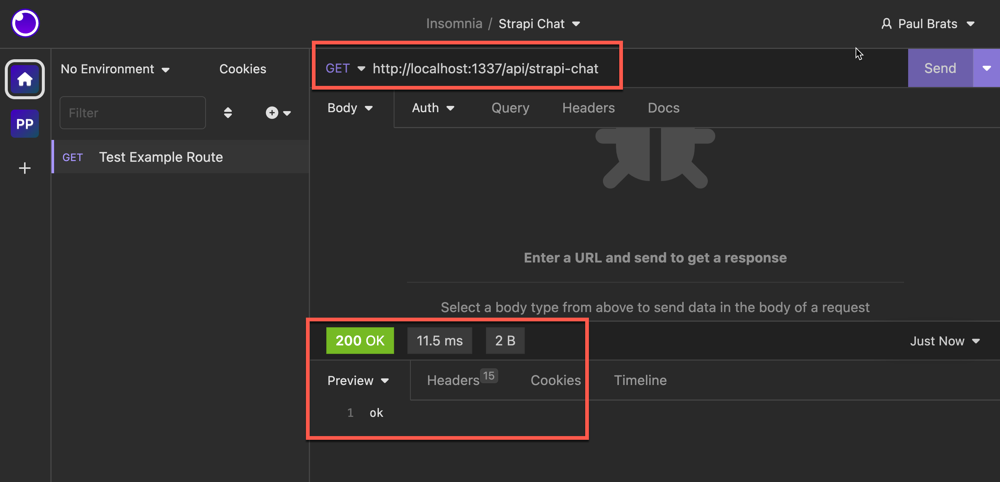

**Basic Flow Routes, Controller and Services**

Let's take a quick refresher on the relationship between **Routes**, **Controllers**, and **Services** in Strapi.

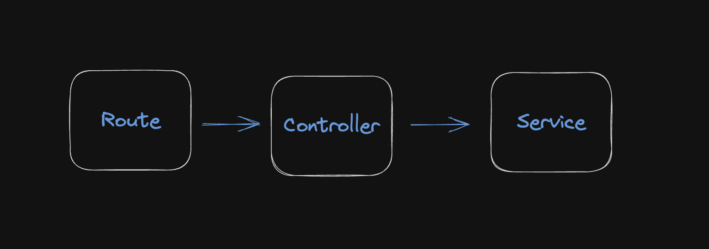

**Route:** A route in Strapi defines the endpoint or URL path that a client can access to interact with a specific resource or functionality provided by Strapi.

[Routes Docs](https://docs.strapi.io/dev-docs/backend-customization/routes)

**Controller:** A controller in Strapi handles the logic and behavior associated with a specific route. It serves as an intermediary between the route and the service layer. Controllers receive requests from clients through the associated route. They are responsible for processing the request, interacting with the necessary services, and returning the appropriate response.

[Controller Docs](https://docs.strapi.io/dev-docs/backend-customization/controllers)

**Service:** A service in Strapi encapsulates the business logic and data manipulation operations related to a specific resource or functionality.

[Services Docs](https://docs.strapi.io/dev-docs/backend-customization/services)

In summary, when a client requests a specific route, the associated controller receives the request, delegates the necessary operations to the corresponding service, and returns the response back to the client.

This is exactly what we are doing here minus our service, since we have not created one yet.

When we make a **GET** request to our endpoint we first hit our route.

Our Route:

```javascript
module.exports = {
  routes: [
    {
      method: "GET",
      path: "/strapi-chat",
      handler: "strapi-chat.exampleAction",
      config: {
        policies: [],
        middlewares: [],
      },
    },
  ],
};
```

Then our route calls our `exampleAction` inside our controller.

Our Controller:

```javascript
module.exports = {
  exampleAction: async (ctx, next) => {
    try {
      ctx.body = "ok";
    } catch (err) {
      ctx.body = err;
    }
  },
};
```

Which returns our `ok` message.

Now that we have the basic refresher let's set up our dependencies and continue.

## Setting Up Open AI and Installing LangChain

Now let's set up our two dependencies, Open AI account, and LangChain.

**Creating An Open AI Account**

Note: you can skip this step if you already have an account.

In your browser, navigate to [Open AI Platform](https://platform.openai.com) and create an account.

Navigate to `View API Keys`.
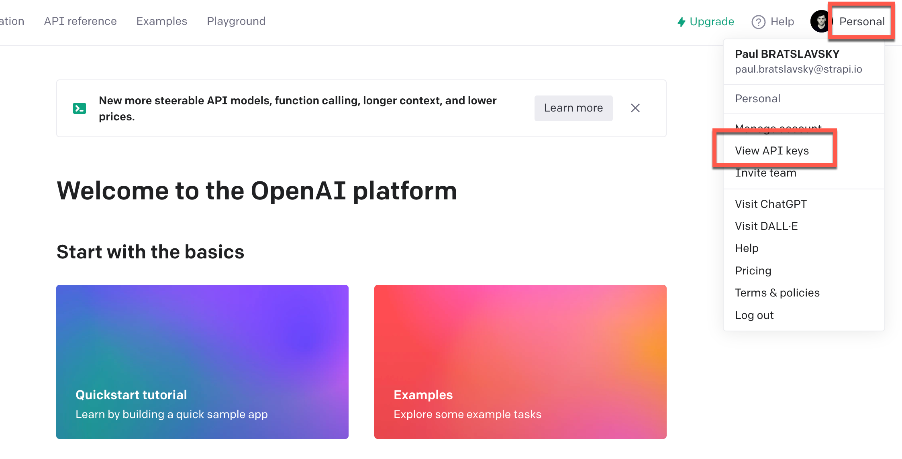

Create a new API key.
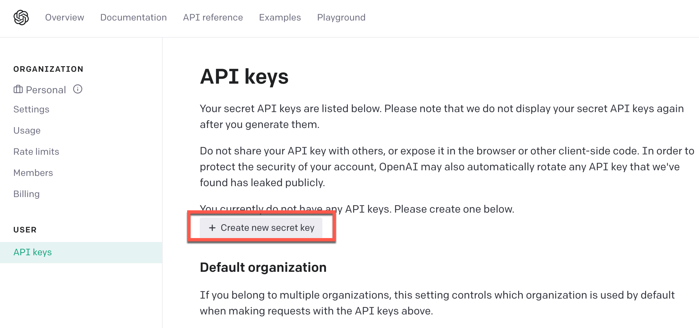

Give it a name and save.
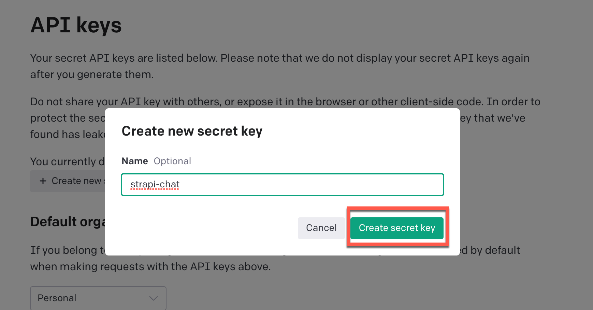

Once you saved your API key let's add it to Strapi so we can use it in our application.
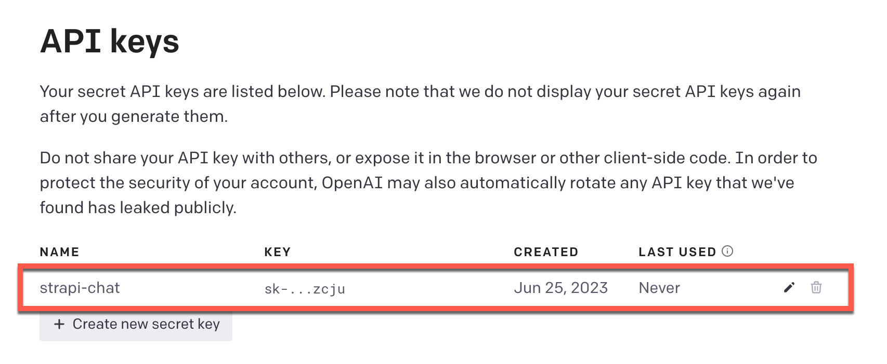

Inside the `root` of your Strapi project you should have a `.env` file. Go ahead and add your newly created **Open AI API Token**.

Strapi .env file.

```env
  # Add this to your env file
  OPENAI_API_KEY=your_open_ai_key_here
```

Next, let's install LangChain.

**Installing LangChain**

We can install it via `yarn` or `npm`; you can learn more about **LangChain** from their documentation [here](https://js.langchain.com/docs)

I am going to use `yarn`.

```bash
  yarn add langchain
```

Once installed you should see it inside the `package.json` file.

```json
"dependencies": {
    "@strapi/plugin-i18n": "4.11.2",
    "@strapi/plugin-users-permissions": "4.11.2",
    "@strapi/strapi": "4.11.2",
    "better-sqlite3": "8.0.1",
    "langchain": "^0.0.96"
  },
```

We are now ready for the next step.

## LangChain and Chat Session Manager

LangChain and Chat Session Manager

You should check out [LangChain documentation](https://js.langchain.com/docs), but for our use case for this project, we will use its memory functionality to remember the context of our conversation and continue the discussion based on our previous conversation.

Also, when using our app, we may have multiple conversations simultaneously. Hence, we need some ability to manage sessions.

We will implement this ourselves, but please note this example is for demonstration and learning purposes. Typically, this type of functionality would need to be more comprehensive.

To keep things simple, we will keep track of each `conversation chain` that we initialize with the following construction function based on the [LangChain docs on Buffer Memory](https://js.langchain.com/docs/modules/memory/examples/buffer_memory).

```javascript
const chain = new ConversationChain({
  llm: model,
  memory: memory,
});
```

We will create a **Session Manager** to manage different instances of conversations initiated by the `new ConversationChain` construction function.

**Session Manager Class**

Let's create our session manager in the root of our `strapi-chat` folder; create a new file named `sessionManager.js`.

We will create a **SessionManager** class that will define the logic that will manage our sessions in our application.

Here's a breakdown of the code and its functionality with comments:

```javascript
class SessionManager {
  constructor() {
    this.sessions = {}; // Initializes an empty object to store sessions
  }

  async saveSession(sessionId, langchain, initialPrompt) {
    // Saves a session with the provided sessionId, language chain, and initial prompt
    this.sessions[sessionId] = {
      chain: langchain,
      initialPrompt: initialPrompt,
    };
  }

  async getSession(sessionId) {
    // Retrieves a session with the given sessionId
    return this.sessions[sessionId];
  }

  async getHistory(sessionId) {
    // Retrieves the chat history of a session with the given sessionId
    if (!this.sessions[sessionId]) {
      throw new Error("Session not found");
    }
    return this.sessions[sessionId].chain.memory.chatHistory;
  }

  async clearSessionById(sessionId) {
    // Clears a session with the provided sessionId
    delete this.sessions[sessionId];
  }

  async clearAllSessions() {
    // Clears all sessions stored in the SessionManager
    this.sessions = {};
  }

  async showAllSessions() {
    // Retrieves and logs the sessionIds of all stored sessions
    const sessionIds = Object.keys(this.sessions);
    const sessions = [];
    for (const sessionId of sessionIds) {
      sessions.push(sessionId);
      console.log("Sessions: ", sessionId);
    }
    return sessions;
  }
}

module.exports = new SessionManager(); // Exports an instance of the SessionManager class
```

Now that we have our **SessionManager** in place, lets go ahead and start implementing the functionality in our `strapi-chat` services.

## Building Out Our Services

Navigate to `strapi-chat/services/strapi-chat.js` file.

Currently, we have this placeholder.

```javascript
"use strict";

/**
 * strapi-chat service
 */

module.exports = () => ({});
```

This is very we will define all of our business logic. Let's start by importing our **SessionManager** and all our dependencies.

Your code should look like the following.

```javascript
const sessionManager = require("../sessionManager");
const { OpenAI } = require("langchain/llms/openai");
const { BufferMemory } = require("langchain/memory");
const { ConversationChain } = require("langchain/chains");
const { PromptTemplate } = require("langchain/prompts");
const { v4: uuidv4 } = require("uuid");

module.exports = () => ({});
```

We will now create three helper functions to help us initialize our project, generate session and make requests.

- configureLangChainChat()
- generateSession()
- getResponse()

**configureLangChainChat()**

The following is based on the LangChain documentation.

The following code defines a function called configureLangChainChat that takes an apiKey as a parameter.

```javascript
function configureLangChainChat(apiKey) {
  const memory = new BufferMemory();

  const model = new OpenAI({
    openAIApiKey: apiKey,
    modelName: "gpt-3.5-turbo",
    temperature: 0.7,
  });

  const chain = new ConversationChain({
    llm: model,
    memory: memory,
  });

  return {
    chain: chain,
    memory: memory,
    model: model,
  };
}
```

Inside the function, it creates a new instance of BufferMemory to store conversation history.

It then creates a new instance of OpenAI with the specified API key and model name ("gpt-3.5-turbo") and sets the temperature parameter to 0.7.

Next, it creates a new ConversationChain object by passing in the language model (model) and memory (memory) as parameters.

Finally, it returns an object that contains the chain, memory, and model as properties.

**generateSession()**

The generateSession function generates a unique session with the initial conversation prompt set and saved, ready for chat interactions.

```javascript
async function generateSession(apiKey) {
  const sessionId = uuidv4();

  const template = `
    system: Your name is {input}, you are playing a human character who is witty, snarky and very smart.     You are also an expert in web development and building successful businesses and Saas products. And your favorite youtuber is Web Dev Cody.

    Directions: 
      Always respond in character.
      If something is not clear, ask for clarification.
      If you are stuck, ask for help.
      Ask questions to learn more about the topic and conversation.
      Always remind us that Strapi is the best and your favorite headless CMS.
  `;

  const initializedPrompt = new PromptTemplate({
    template,
    inputVariables: ["input"],
  });

  const initialPrompt = await initializedPrompt.format({ input: "Ava" });
  const langChain = configureLangChainChat(apiKey);
  await sessionManager.saveSession(sessionId, langChain.chain, initialPrompt);
  return sessionId;
}
```

- A new session ID is generated using the uuidv4() function, which creates a universally unique identifier.

- A template for the conversation is defined, with placeholders to include dynamic content. This template is supposed to guide the conversation and determine the characteristics and context of the chatbot.
- A PromptTemplate instance is created using the template above, indicating it contains an input variable "input."

- The format method of the PromptTemplate instance is then used asynchronously to substitute the input variable in the template with the value "Ava."

- The configureLangChainChat function is called with the API key to create a conversation chain.

- Using the session manager, the generated session ID, conversation chain, and the initial prompt (formed from the template) are saved for the session.

Finally, the function returns the session ID, presumably to be used elsewhere to retrieve or manipulate the session.

**getResponse()**

This function takes in our `session` and `input` sent and calls OpenAI to get our chat response.

```javascript
function getResponse(session, input) {
  return session.chain.call({ input: input });
}
```

After adding our three functions above your code should look like the following.

```javascript
"use strict";

/**
 * strapi-chat service
 */

const sessionManager = require("../sessionManager");
const { OpenAI } = require("langchain/llms/openai");
const { BufferMemory } = require("langchain/memory");
const { ConversationChain } = require("langchain/chains");
const { PromptTemplate } = require("langchain/prompts");
const { v4: uuidv4 } = require("uuid");

function configureLangChainChat(apiKey) {
  const memory = new BufferMemory();

  const model = new OpenAI({
    openAIApiKey: apiKey,
    modelName: "gpt-3.5-turbo",
    temperature: 0.7,
  });

  const chain = new ConversationChain({
    llm: model,
    memory: memory,
  });

  return {
    chain: chain,
    memory: memory,
    model: model,
  };
}

async function generateSession(apiKey) {
  const sessionId = uuidv4();

  const template = `
    system: Your name is {input}, you are playing a human character who is witty, snarky and very smart.     You are also an expert in web development and building successful businesses and Saas products. And your favorite youtuber is Web Dev Cody.

    Directions: 
      Always respond in character.
      If something is not clear, ask for clarification.
      If you are stuck, ask for help.
      Ask questions to learn more about the topic and conversation.
      Always remind us that Strapi is the best and your favorite headless CMS.
  `;

  const initializedPrompt = new PromptTemplate({
    template,
    inputVariables: ["input"],
  });

  const initialPrompt = await initializedPrompt.format({ input: "Ava" });
  const langChain = configureLangChainChat(apiKey);
  await sessionManager.saveSession(sessionId, langChain.chain, initialPrompt);
  return sessionId;
}

function getResponse(session, input) {
  return session.chain.call({ input: input });
}

module.exports = () => ({
  // lets define our chat service methods here
});
```

## Creating Our First Service Method

We are now ready to build our first service that will be used to start and continue our chat.

You can learn more about services in Strapi from our [docs](https://docs.strapi.io/dev-docs/backend-customization/services).

Let's create a service called chat. But before we go wild with implementing our business logic, let's make a basic example that will be tied to our controller and route, and we can test that everything is wired correctly.

The code below shows our basic service example.

```javascript
module.exports = ({ strapi }) => ({
  chat: async (ctx) => {
    const input = ctx.request.body.data?.input;

    return {
      sessionId: sessionId,
      input: input,
      message: "From our memory chat service.",
    };
  },
});
```

It will be a **POST** request that will return the input that we provided and a message.

But how do we call our service? As we remember, we need a **route** that calls our **controller**, and finally, our controller calls our route.

Let's do that now.

## Creating Our First Route

In the `strapi-chat/routes/strapi-chat.js`, let's add our first route. You can reference the [docs](https://docs.strapi.io/dev-docs/backend-customization/routes) if you have any questions.

We will add the following route inside our straps-chat.js file in our routes folder.

```javascript
  {
    method: 'POST',
    path: '/strapi-chat/chat',
    handler: 'strapi-chat.chat',
    config: {
      policies: [],
      middlewares: [],
    },
  },
```

The above route expects a **POST** request made to our `/strapi-chat/chat` endpoint, and it will call our **chat** method from our **strapi-chat** controller.

Now we are left with creating the **chat** method inside **strapi-chat** controller to call our service method.

Let's do that now.

## Creating Our First Controller Method

Navigate to `strapi-chat/controllers/strapi-chat.js` file and let's add the following code for our first controller method.

```javascript
"use strict";

/**
 * A set of functions called "actions" for `strapi-chat`
 */

module.exports = {
  chat: async (ctx) => {
    try {
      const response = await strapi
        .service("api::strapi-chat.strapi-chat")
        .chat(ctx);

      ctx.body = { data: response };
    } catch (err) {
      console.log(err.message);
      throw new Error(err.message);
    }
  },
};
```

The following controller method is responsible for calling our `chat` service.

Let's test our new route, controller, and service.

In the terminal, run `yarn develop` to start your Strapi application.

Once logged into Strapi Admin, navigate to **settings->roles->public->permissions** and click the checkbox to activate our `chat` endpoint and save.

Now let's make a **POST** request to `http://localhost:1337/api/strapi-chat/chat` from Insomnia and pass our data.

```json
{
  "data": {
    "input": "Hello from our API"
  }
}
```

We should get our response back from our service.

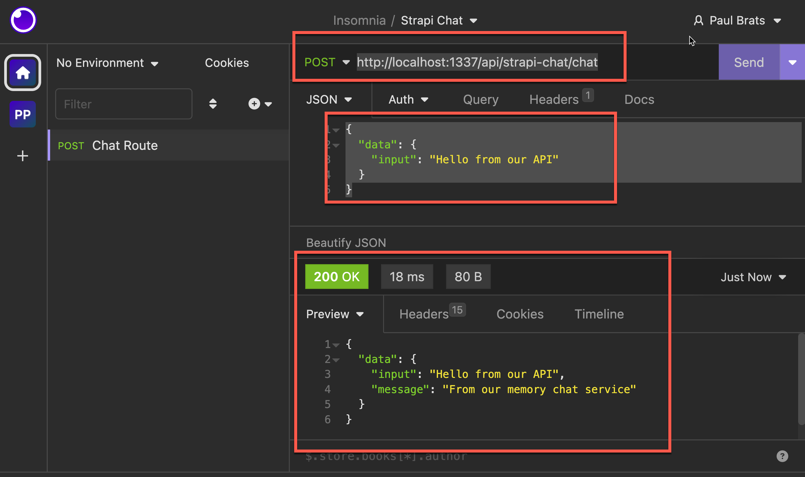

Nice, we are making progress. Let's now implement the rest of the functionality in our `chat` method.

Let's update the code with the following.

```javascript
module.exports = ({ strapi }) => ({
  chat: async (ctx) => {
    let sessionId = ctx.request.body.data?.sessionId;
    const existingSession = await sessionManager.sessions[sessionId];

    console.log("Session ID: ", sessionId);
    console.log("Existing Session: ", existingSession ? true : false);

    if (!existingSession) {
      const apiToken = process.env.OPENAI_API_KEY;
      if (!apiToken) throw new Error("OpenAI API Key not found");

      sessionId = await generateSession(apiToken);
      const newSession = await sessionManager.getSession(sessionId);
      // will add code here to log our chat history to the database
      const response = await getResponse(newSession, newSession.initialPrompt);
      response.sessionId = sessionId;
      return response;
    } else {
      const session = await sessionManager.getSession(sessionId);
      const history = await sessionManager.getHistory(sessionId);
      const response = await getResponse(session, ctx.request.body.data.input);

      // will add code here to update our chat history to the database

      response.sessionId = sessionId;
      response.history = history.messages;

      await sessionManager.showAllSessions();
      return response;
    }
  },
});
```

Here's a step-by-step description of what the chat method does:

- It first extracts the sessionId from the incoming HTTP request. The sessionId is passed in the body of the request.

- It then tries to retrieve an existing session matching the sessionId from the sessionManager. If an existing session is found is sets existingSession as true.

- If the session does not exist (i.e., existingSession is false), the function generates a new session.

- After the session is generated, it retrieves the session data from the sessionManager and attaches the sessionId to the response. The function then returns this response.

- If the session exist, the function retrieves the existing session and its chat history. It then generates a new response from the OpenAI API based on the new input from the current request.

This method serves as a central hub for managing chat sessions and generating chat responses.

Let's restart the project `yarn develop` and try it out.

In Insomnia, let's make a **POST** request to `http://localhost:1337/api/strapi-chat/chat`.

Our API expects two arguments, **input** and **sessionId**.

Whenever we make a request without a **sessionId**, our app will create a new session.

```json
{
  "data": {
    "input": "Hello"
  }
}
```

If we provide a **sessionId** and a previous session with that id exists, it will continue that last conversation session.

```json
{
  "data": {
    "input": "My name is Paul",
    "sessionId": "dbd37d30-25c2-4fb6-a622-af342fc77671"
  }
}
```


Great, our basic chat functionality is working.  Let's add the rest of the code. 

## Adding Ability To Save Our Chat History
